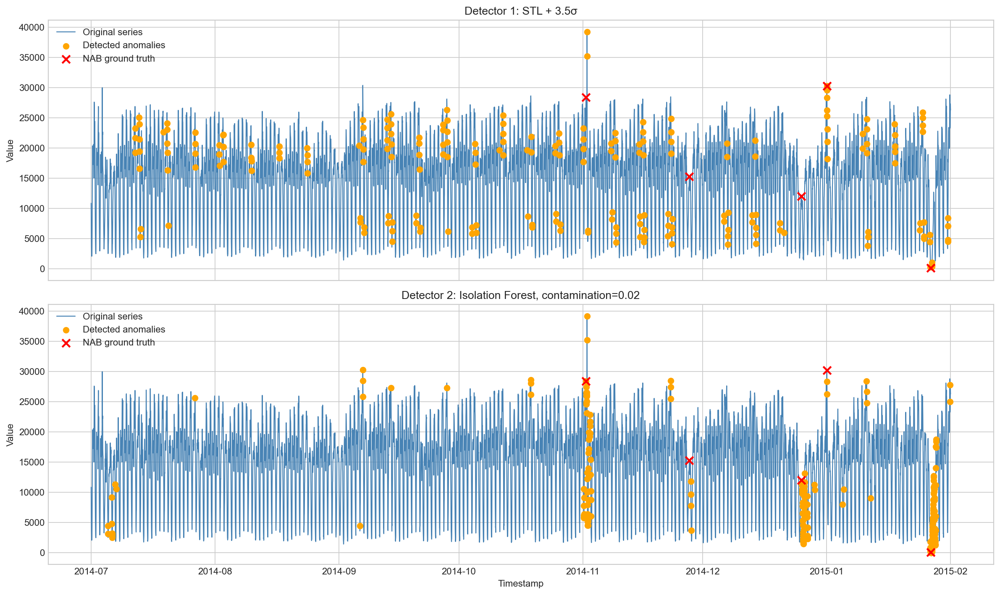
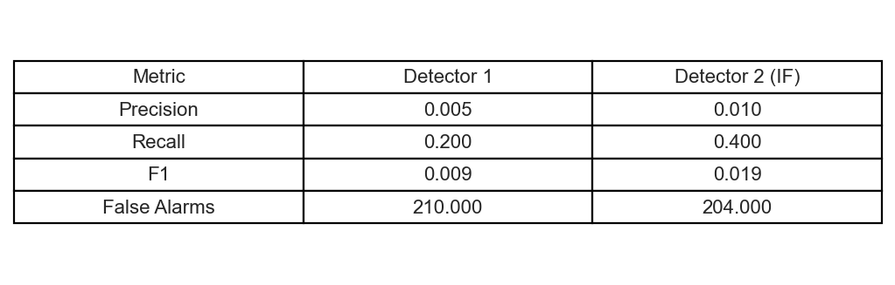
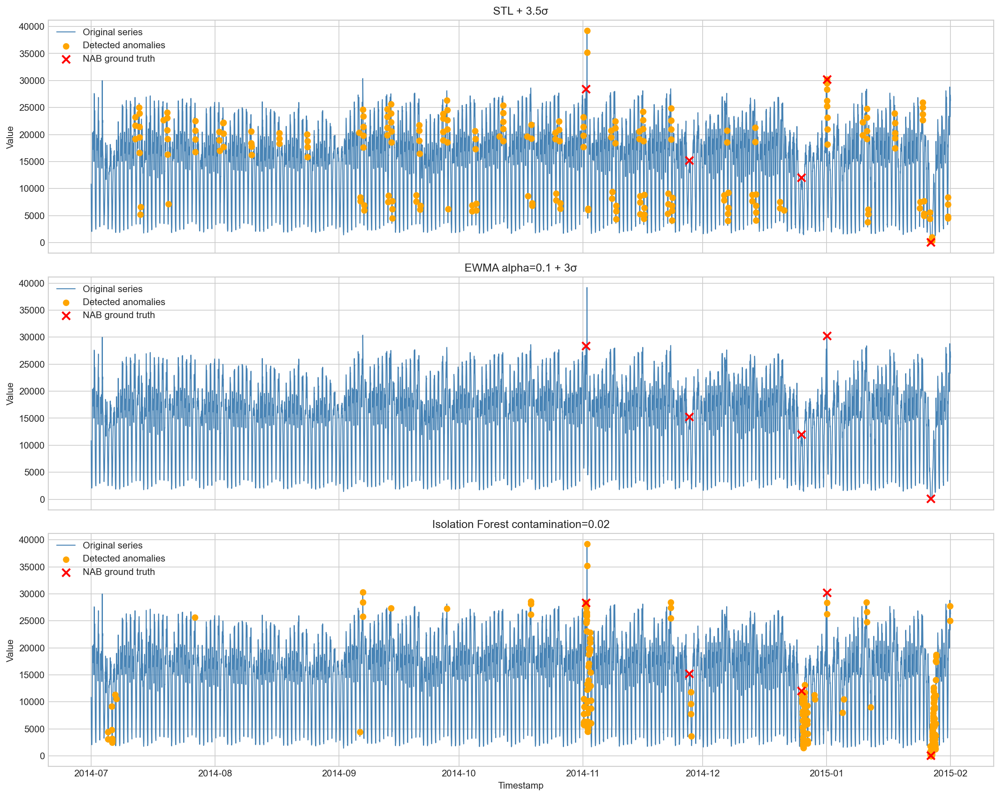

# Phase 3 - So Sanh & Reflection

## Screenshots

### Plot ket qua anomaly detection



### Bang so sanh precision/recall



## Bang so sanh 2 detector

| Metric | Detector 1: STL + 3.5 sigma | Detector 2: Isolation Forest |
|---|---:|---:|
| Precision | 0.004739 | 0.009709 |
| Recall | 0.200000 | 0.400000 |
| F1 | 0.009259 | 0.018957 |
| False Alarms | 210 | 204 |

## Tune log

### Isolation Forest contamination tuning

| Contamination | Precision | Recall | F1 | False Alarms | Predicted Anomalies |
|---:|---:|---:|---:|---:|---:|
| 0.01 | 0.009 | 0.200 | 0.019 | 102 | 103 |
| 0.02 | 0.010 | 0.400 | 0.019 | 204 | 206 |
| 0.05 | 0.006 | 0.600 | 0.012 | 511 | 514 |

### STL threshold tuning

| Threshold | Precision | Recall | F1 | False Alarms | Predicted Anomalies |
|---:|---:|---:|---:|---:|---:|
| 2.5 | 0.002 | 0.200 | 0.003 | 574 | 575 |
| 3.0 | 0.003 | 0.200 | 0.005 | 377 | 378 |
| 3.5 | 0.005 | 0.200 | 0.009 | 210 | 211 |

Raw logs are saved in `artifacts/tuning_log.txt`.

## Model artifacts

Isolation Forest artifact:

```text
artifacts/isolation_forest_nyc_taxi.joblib
```

Model size: about 397 KB, smaller than 1 MB.

## Reflection

Dataset nyc_taxi.csv là chuỗi thời gian về nhu cầu taxi, được lấy mẫu mỗi 30 phút. Từ EDA, ACF có spike mạnh ở lag 48, tương ứng với chu kỳ ngày, và lag 336, tương ứng với chu kỳ tuần. Vì vậy, dữ liệu có seasonal pattern rõ ràng. Histogram không phải Gaussian hoàn hảo và skewness âm nhẹ, nên không nên dùng mean/std global đơn giản.

Detector statistical được chọn là STL + threshold vì STL tách trend/seasonality ra khỏi signal, sau đó anomaly được detect trên residual. Cách này phù hợp hơn rolling Z-score thuần túy vì raw series có seasonality mạnh.

Detector ML là Isolation Forest với feature table gồm value hiện tại, lag features, rolling mean/std/min/max, diff, hour, dayofweek và weekend. Cách này cho model biết ngữ cảnh thời gian và pattern lặp lại.

Trong strict point-label evaluation của NAB, Isolation Forest tốt hơn STL về recall và F1. Isolation Forest với contamination 0.02 bắt được 2/5 ground-truth anomalies, trong khi STL threshold 3.5 chỉ bắt được 1/5. Tuy nhiên, cả hai detector đều có nhiều false alarms vì NAB labels rất sparse và evaluation đang chấm đúng timestamp chính xác. Trong production, nên dùng anomaly window, gom các alert gần nhau, và thêm suppression rule để tránh báo động lặp lại.

Production choice: chọn Isolation Forest với contamination thấp, vì recall/F1 tốt hơn và có thể tận dụng feature engineering. Sau đó cần thêm post-processing: group anomaly points thành incident windows, alert only once per window, và monitor drift theo ngày/tuần.

## Bonus

### EWMA detector alpha = 0.1



| Detector | Precision | Recall | F1 | False Alarms |
|---|---:|---:|---:|---:|
| STL + 3.5 sigma | 0.004739 | 0.200000 | 0.009259 | 210 |
| EWMA alpha=0.1 + 3 sigma | 0.000000 | 0.000000 | 0.000000 | 0 |
| Isolation Forest c=0.02 | 0.009709 | 0.400000 | 0.018957 | 204 |

Nhận xét: EWMA được tính theo đúng bài học: baseline là `ewm(alpha=0.1).mean()` và độ dao động kỳ vọng là `ewm(alpha=0.1).std()`. Với ngưỡng 3 sigma, EWMA quá bảo thủ trên dataset này nên không bắt được ground-truth anomaly nào. STL bắt được 1/5 anomaly, còn Isolation Forest bắt được 2/5 anomaly và có F1 cao nhất trong 3 phương pháp.

### Log transform trên skewed data

| Method | Skewness | Precision | Recall | F1 | False Alarms |
|---|---:|---:|---:|---:|---:|
| Raw value + global 3 sigma | -0.452390 | 0.000000 | 0.000000 | 0.000000 | 1 |
| log1p(value) + global 3 sigma | -1.926757 | 0.040000 | 0.200000 | 0.066667 | 24 |

Nhận xét: `nyc_taxi.csv` chỉ skew nhẹ (`|skewness| < 0.5`), nên log transform ở đây là thí nghiệm bonus chứ không phải bước bắt buộc. Log transform làm thay đổi distribution và giúp global 3 sigma bắt được 1/5 anomaly, trong khi raw global 3 sigma không bắt được anomaly nào. Tuy nhiên log transform cũng làm skewness âm mạnh hơn trong dataset này, nên không phải lúc nào cũng cải thiện distribution theo hướng Gaussian. Cần check histogram/skewness sau transform thay vì áp dụng máy móc.

### Multivariate Isolation Forest

Kết hợp 3 NAB series: `nyc_taxi`, `machine_temperature_system_failure`, và `ambient_temperature_system_failure`.

| Detector | Best Contamination | Precision | Recall | F1 |
|---|---:|---:|---:|---:|
| Univariate IF - nyc_taxi only | 0.02 | 0.009709 | 0.400000 | 0.018957 |
| Multivariate IF - 3 NAB series | 0.02 | 0.001302 | 0.200000 | 0.002587 |

Nhận xét: Trong experiment này, multivariate IF kém hơn univariate IF vì các series được combine không cùng một system/context nghiệp vụ. Multivariate detection có ích khi các signal có quan hệ thật sự với nhau, ví dụ CPU, memory, latency, request rate của cùng một service. Nếu ghép các series không liên quan, model có thể học noise và tạo nhiều false alarms hơn.

Raw bonus outputs:

```text
artifacts/bonus_three_detector_comparison.csv
artifacts/bonus_log_transform_comparison.csv
artifacts/bonus_multivariate_iforest_tuning.csv
artifacts/bonus_univariate_vs_multivariate_iforest.csv
```

