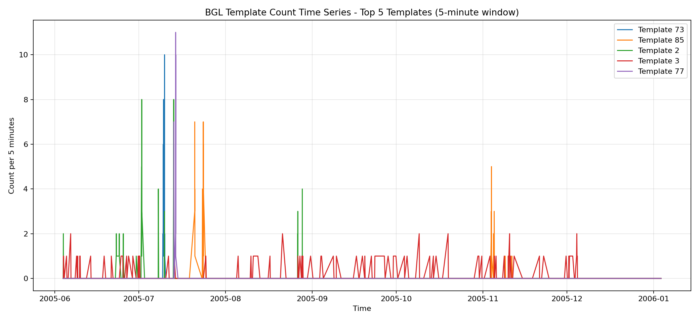
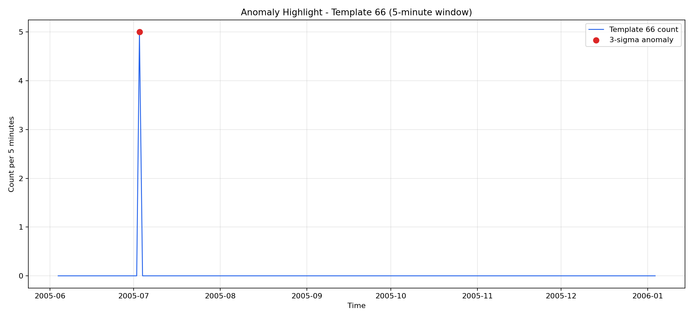

# SUBMIT - Log Mining, Parsing, Anomaly Detection

## Screenshots

### Template count time series



### Anomaly highlighted



The anomaly plot highlights Template `66` with a 3-sigma spike at `2005-07-03 00:45:00`.

## Log

### Drain3 output

Dataset: `logpai loghub master BGL/BGL_2k.log`

```text
Total log lines: 2,000
Drain3 sim_th selected: 0.5
Unique final templates: 151
```

Top-10 templates:

| template_id | count | template |
|---:|---:|---|
| 73 | 180 | `- <*> 2005.07.09 <*> <*> <*> RAS KERNEL INFO generating <*>` |
| 85 | 121 | `- <*> <*> <*> <*> <*> RAS KERNEL INFO <*> floating point alignment exceptions` |
| 2 | 109 | `- <*> <*> <*> <*> <*> RAS KERNEL INFO <*> double-hummer alignment exceptions` |
| 3 | 92 | `- <*> <*> <*> <*> <*> RAS KERNEL INFO CE sym <*> at <*> mask <*>` |
| 77 | 87 | `- <*> 2005.07.13 <*> <*> <*> RAS KERNEL INFO generating <*>` |
| 138 | 71 | `- <*> 2005.12.01 <*> <*> <*> RAS KERNEL INFO <*> total interrupts...` |
| 119 | 61 | `- <*> 2005.11.04 <*> <*> <*> RAS KERNEL INFO iar <*> dear <*>` |
| 14 | 60 | `KERNDTLB <*> 2005.06.11 R30-M0-N9-C:J16-U01 <*> R30-M0-N9-C:J16-U01 RAS KERNEL FATAL data TLB error interrupt` |
| 118 | 59 | `- <*> 2005.11.03 <*> <*> <*> RAS KERNEL INFO iar <*> dear <*>` |
| 137 | 51 | `- <*> 2005.12.01 <*> <*> <*> RAS KERNEL INFO 0 microseconds spent in the rbs signal handler...` |

CSV output: `results/top_templates.csv`

### Tuning log

| drain_sim_th | num_templates | top_template_count | interpretation |
|---:|---:|---:|---|
| 0.3 | 73 | 729 | Too aggressive: many different messages are grouped together. |
| 0.5 | 151 | 180 | Best balance: enough structure without too many tiny templates. |
| 0.7 | 1459 | 71 | Too strict: many variations become separate templates. |

Selected value: `drain_sim_th = 0.5`.

CSV output: `results/drain_sim_th_tuning.csv`

### Log anomaly detection

```text
Template count window: 5 minutes
Detector: 3-sigma on template count
Detected spikes: 687
Top spike:
  timestamp: 2005-07-03 00:45:00
  template_id: 66
  count: 5
  mean: 0.006
  std: 0.173
  threshold: 0.526
  z_score: 28.81
```

With BGL labels (`-` = normal, other labels = anomaly), log-line level evaluation:

```text
tp: 112
fp: 1604
fn: 31
tn: 253
precision: 0.0653
recall: 0.7832
f1: 0.1205
```

### Embedding and new-template detection

```text
TF-IDF matrix: 151 templates x 641 terms
Similarity matrix: 151 x 151
TF-IDF clusters at threshold 0.35: 62
```

Injected unusual log:

```text
UNKNOWN_EVENT 9999999999 2099.01.01 R99-M9-N9-C:J99-U99 2099-01-01-00.00.00.000000 R99-M9-N9-C:J99-U99 RAS QUANTUM CRITICAL quantum cache resonance exceeded impossible_threshold=424242 phase=blue
```

Drain3 result:

```text
before_clusters: 151
after_clusters: 152
is_new_template: True
change_type: cluster_created
```

### Mini Log Analyzer

Script: `log_analyzer.py`

Command:

```bash
python3 log_analyzer.py <logfile>
```

Tested datasets:

| dataset | total_lines | unique_templates | top_template_share_pct |
|---|---:|---:|---:|
| BGL | 2,000 | 151 | 9.0% |
| HDFS | 2,000 | 21 | 15.7% |

BGL has more templates because it is a supercomputer log with many hardware, kernel, component, severity, and event patterns. HDFS has fewer templates because `HDFS_2k` repeats block/DataNode/FSNamesystem operations more often.

## Reflection

Drain3 parsed BGL reasonably well. It successfully grouped repeated hardware/kernel messages such as `generating <*>`, `floating point alignment exceptions`, `double-hummer alignment exceptions`, and `CE sym <*> at <*> mask <*>`. These templates give useful operational insight because they point to recurring kernel and hardware-related issues instead of individual raw lines.

The tuning result shows why `sim_th` matters. At `0.3`, Drain3 grouped too aggressively and produced only `73` templates; the top template had `729` lines, which is too broad. At `0.7`, it produced `1459` templates, which is too fragmented for a 2,000-line dataset. `0.5` gave a better balance with `151` templates.

The most useful insight came from templates around hardware/kernel failures: `data TLB error interrupt`, `program interrupt`, `floating point alignment exceptions`, `double-hummer alignment exceptions`, and memory/error correction patterns. These are much easier to investigate after parsing than by reading 2,000 raw log lines.

Metric and log signals are different. Metrics tell us that something changed, for example latency increased or error rate spiked. Logs explain why it changed by exposing concrete events such as timeout, kernel failure, memory correction, or block operation errors. In practice, metric anomaly detection is best for fast alerting, while log parsing and template anomaly detection are better for root-cause investigation.
