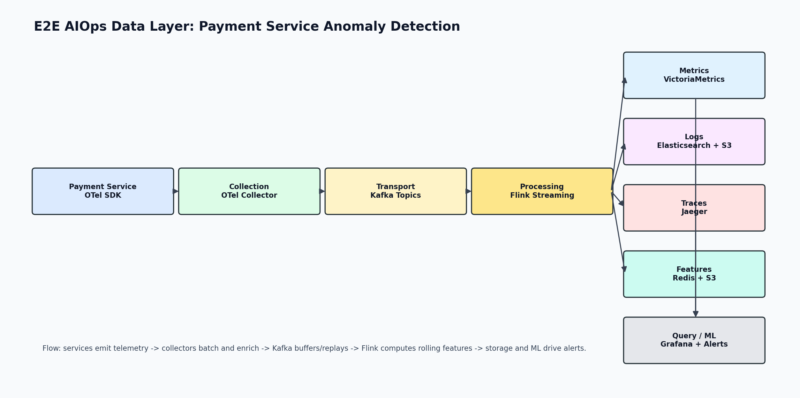

# W1-D3 Submission

## Architecture Diagram

## Cost Estimate

| Tier | Services | Log/day | Metric events/sec | Storage | Compute | Network | Build total | Datadog SaaS | Buy/Build ratio |
| --- | --- | --- | --- | --- | --- | --- | --- | --- | --- |
| Small | 10 | 50 GB | 100,000 | $526 | $2,180 | $56 | $2,762 | $2,960 | 1.1x |
| Medium | 100 | 500 GB | 1,000,000 | $4,262 | $6,250 | $560 | $11,072 | $29,600 | 2.7x |
| Large | 1,000 | 5,000 GB | 10,000,000 | $42,622 | $51,700 | $5,600 | $99,922 | $296,000 | 3.0x |

Assumptions:

- Build stack: OTel Collector, Kafka, Flink, VictoriaMetrics, Elasticsearch hot tier, S3 Parquet cold tier, Jaeger, Grafana.
- Logs: 7 days hot in Elasticsearch, 23 days cold in S3 Parquet with 50% compression.
- Metrics: 30-day retention in VictoriaMetrics, scaled from $2,000/month per 1M metric events/sec.
- Datadog estimate includes infrastructure/APM hosts, log ingest, 20% indexed logs, and custom metric volume.
- People cost is excluded; self-hosting usually needs SRE time that grows with scale.

## ADR Summary

ADR-001 chooses Kafka as the transport layer between OpenTelemetry Collectors and downstream processing/storage. The main reason is durability and decoupling: if Elasticsearch, Jaeger, or the Flink feature job slows down, telemetry can stay in Kafka and be replayed later instead of being dropped at the collector. This also allows multiple consumers to read the same stream for hot indexing, S3 archival, feature extraction, and debugging.

The trade-off is extra cost and complexity. Kafka adds about 5-20 ms of latency, which is acceptable for this observability pipeline because alert windows are normally 30 seconds to 5 minutes. Estimated Kafka cost is about $1,430/month at Small, $3,500/month at Medium, and $26,200/month at Large. The decision is accepted because replay, backpressure control, and multi-consumer support are more valuable than the small latency increase.

## Reflection

For a 50-service Series A startup, I would recommend buying observability first, probably Datadog or a similar managed platform, while still instrumenting services with OpenTelemetry to reduce long-term vendor lock-in.

The reason is not pure infrastructure cost. At this scale the self-hosted stack may look cheaper on paper than SaaS, but the real constraint for a Series A startup is engineering focus. Running Kafka, Flink, Elasticsearch, VictoriaMetrics, Jaeger, Grafana, alerting, backups, retention policies, and on-call reliability needs platform time. Even one strong platform engineer spending 30-50% of their time operating observability is expensive compared with using that time to improve product reliability, deployment speed, and incident response.

I would build only the parts that create strategic leverage: standard OTel instrumentation, useful service-level objectives, clean log schemas, and a small feature extraction prototype if anomaly detection is a near-term product requirement. I would avoid self-hosting the full data layer until the company hits clear pain points such as SaaS bills above roughly $50K/month, strict data residency requirements, or a team large enough to justify 2-3 SREs dedicated to the platform.

The pragmatic recommendation is: buy the backend now, keep the telemetry format portable, and revisit build vs buy after the company has more scale, more predictable traffic, and enough platform staffing to operate the stack safely.
