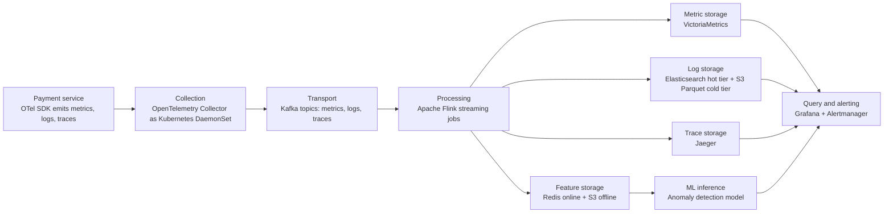

# E2E AIOps Data Layer: Payment Service Anomaly Detection

## Use Case

Detect latency and error-rate anomalies in a payment service, then support drill-down from the alert to traces and logs for root-cause analysis.

## Architecture

## Component Choices

| Stage | Tool | Reason |
| --- | --- | --- |
| Service instrumentation | OpenTelemetry SDK | One standard API for metrics, logs, and traces; vendor-neutral. |
| Collection | OpenTelemetry Collector | Central place to batch, retry, enrich, and route telemetry before storage. |
| Transport | Kafka | Buffers bursts from many services, supports replay, and lets multiple consumers read the same stream. |
| Processing | Apache Flink | Computes rolling features, joins metric spikes with log spikes, and supports stateful streaming. |
| Metric storage | VictoriaMetrics | Prometheus-compatible, lower cost for longer retention than single-node Prometheus. |
| Log storage | Elasticsearch hot tier + S3 Parquet cold tier | Fast search for recent incidents, cheap long-term retention for post-mortems and training data. |
| Trace storage | Jaeger | Open-source distributed tracing backend compatible with OTel trace data. |
| Feature storage | Redis online + S3 offline | Redis serves low-latency model inference; S3 keeps historical features for training. |
| Query/ML | Grafana, Alertmanager, anomaly model | Operators get dashboards and alerts; ML consumes stream features for anomaly detection. |

## Data Flow

1. Payment service emits `latency_p99`, `error_rate`, structured logs, and spans through the OTel SDK.
2. OTel Collector batches telemetry and adds Kubernetes metadata such as namespace, pod, node, and deployment version.
3. Kafka decouples producers from storage and processing so a storage outage does not immediately drop telemetry.
4. Flink computes rolling mean, rolling standard deviation, rate of change, and anomaly scores from the metric stream.
5. Hot data stays queryable in VictoriaMetrics, Elasticsearch, and Jaeger; older logs and features are compacted to S3 Parquet.
6. Grafana shows the alert, the correlated log spike, and example traces for the same time window.

## Trade-Offs

- Kafka adds operational complexity and roughly 5-20 ms latency, but it provides replay and backpressure protection.
- Elasticsearch is expensive for long retention, so only recent logs stay hot; older logs move to S3 Parquet.
- A feature store is useful here because online inference and offline training need consistent rolling-window features.
