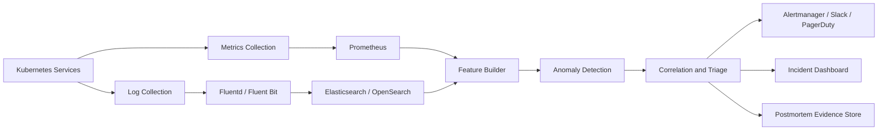

# Bonus - AIOps Detection and Triage Pipeline

## Goal

The goal of this pipeline is to detect incidents earlier than static threshold alerts and help engineers answer three operational questions quickly:

- **WHEN:** When did the anomaly start?
- **WHERE:** Which service, metric, and log pattern showed the first signal?
- **WHY / WHAT:** What is the likely failure mechanism?

For this incident, the pipeline should detect cart-service heap pressure, GC overhead, cache eviction failure, latency degradation, restart loop, and downstream timeout propagation before the final 23:04 UTC alert.

## Proposed Pipeline



## Tool Choices and Why

| Layer | Tool | Why this tool |
|---|---|---|
| Metrics collection | Prometheus | It is Kubernetes-native, supports pull-based scraping, works well with service labels, and provides PromQL for time-series queries. |
| Metrics dashboard | Grafana | It is widely used with Prometheus and makes it easy to visualize latency, 5xx, GC, memory, and restart timelines. |
| Log collection | Fluent Bit or Fluentd | The assignment already mentions Fluentd. Fluent Bit is lighter for production agents, while Fluentd is flexible for parsing and routing. |
| Log storage/search | Elasticsearch or OpenSearch | Logs need fast pattern search, aggregation by level/message, and time-window filtering during triage. |
| Stream / feature processing | Python batch job, Airflow, or Kafka Streams | Python is enough for this lab. In production, Airflow can schedule feature jobs, while Kafka Streams can process near real-time signals. |
| Anomaly detection | Python, scikit-learn, PyOD, or custom rules | Rolling Z-score and MAD are explainable and easy to operate. More advanced models can be added later after baselines are trusted. |
| Alert routing | Alertmanager and PagerDuty/Slack | Alertmanager integrates naturally with Prometheus. PagerDuty/Slack help notify the right on-call engineer. |
| Evidence storage | Markdown/CSV in object storage or Git | Incident evidence should be reproducible, reviewable, and easy to attach to postmortems. |

## How the Pipeline Works

### 1. Collect Metrics

Prometheus scrapes service metrics every 30 seconds:

- `http_p99_latency_ms`
- `http_5xx_rate`
- `jvm_gc_pause_ms_avg`
- `memory_usage_bytes`
- `container_restart_count`
- `upstream_timeout_rate`
- `cart_upstream_error_rate`

**Why:** Metrics provide continuous numeric signals and make it possible to detect gradual degradation before users see hard failures.

### 2. Collect Logs

Fluent Bit/Fluentd collects JSON logs from each pod and sends them to Elasticsearch/OpenSearch.

Important parsed fields:

- `timestamp`
- `level`
- `service`
- `pod`
- `trace_id`
- `message`
- normalized `message_pattern`

**Why:** Logs explain the mechanism behind metrics. In this incident, metrics showed latency and restarts, but logs explained the cause: GC overhead, cache eviction failure, OutOfMemoryError, and OOMKilled events.

### 3. Build Features

A feature builder runs every 1 to 5 minutes and creates time-window features.

Metric features:

- rolling mean and standard deviation
- rolling z-score
- MAD score
- restart count delta
- latency slope
- 5xx rate change

Log features:

- count of WARN/ERROR/FATAL per 5 minutes
- count of each normalized message pattern
- first seen timestamp for new error patterns
- rate of GC overhead warnings
- rate of OOM and cache eviction messages

**Why:** Raw telemetry is noisy. Feature extraction converts raw metrics and logs into signals that can be compared, ranked, and correlated.

### 4. Detect Anomalies

The pipeline should use both rule-based and statistical detection.

Recommended detectors:

| Detector | How it works | Why use it |
|---|---|---|
| Static threshold | Alert when known bad values are crossed, such as 5xx > 5%. | Simple and reliable for known failure states. |
| Rolling Z-score | Compare current value with recent rolling baseline. | Good for sudden changes such as restart spikes and sharp 5xx increases. |
| MAD | Compare value with robust median baseline. | Good for skewed data and sustained latency degradation. |
| Log pattern rules | Alert when critical patterns appear, such as OOMKilled or GC overhead. | Gives earlier and more explainable signals than metrics alone. |

For this incident, recommended early-warning rules are:

```text
GC overhead warnings > N per 5 minutes
ProductCatalogCache eviction failures > N per 5 minutes
OutOfMemoryError imminent count > 0
Container OOMKilled count > 0
cart-service p99 latency rolling z-score > 3
container_restart_count delta > 0
api-gateway cart_upstream_error_rate > 5%
```

**Why:** The official alert fired late because it focused on high 5xx and restarts. The earlier signals were GC overhead and cache eviction failure logs.

### 5. Correlate Signals

The triage layer groups anomalies by service and time window.

Example correlation logic:

```text
If cart-service has GC overhead warnings
AND ProductCatalogCache eviction failures
AND p99 latency is increasing
THEN classify as "cart-service JVM heap pressure / cache eviction issue".

If OOMKilled appears
AND container_restart_count increases
THEN classify as "restart loop confirmed".

If api-gateway cart_upstream_error_rate increases after cart-service anomalies
THEN classify as "downstream impact from cart-service".
```

**Why:** Single alerts are often symptoms. Correlation helps turn many noisy signals into one incident story.

### 6. Alert and Triage

Alerts should include:

- affected service
- earliest signal timestamp
- strongest evidence
- likely root cause category
- downstream services affected
- links to dashboard/log query

Example alert:

```text
[WARNING] cart-service possible JVM heap pressure
Earliest signal: 2026-06-01 06:30:32 UTC
Evidence:
- GC overhead warnings increased
- ProductCatalogCache eviction failures detected
- p99 latency trending upward
Suggested triage:
- Check JVM heap and cache eviction policy
- Check pod restart events and OOMKilled logs
- Check downstream timeout rates
```

**Why:** A useful alert should not only say what is broken. It should help the on-call engineer decide where to look first.

## Why This Pipeline Would Detect the Incident Earlier

The official alert happened at 23:04 UTC, after cart-service 5xx and restarts were already severe. The proposed pipeline would have detected earlier phases:

| Time UTC | Pipeline Signal | Detection Layer |
|---|---|---|
| 06:30:32 | GC overhead warning | Log pattern detection |
| 06:33:57 | ProductCatalogCache eviction failure | Log pattern detection |
| 16:18:00 | JVM GC pause anomaly | Rolling Z-score |
| 18:59:30 | p99 latency degradation | Metric threshold / MAD |
| 19:59:31 | OOMKilled event | Critical log rule |
| 20:00:00 | restart count increase | Metric rule |
| 20:46:00 | api-gateway cart upstream errors | Downstream correlation |

This means the team could have received an early warning many hours before the official 23:04 UTC alert.

## Final Design Decision

For this lab, the best practical pipeline is:

```text
Prometheus + Grafana for metrics
Fluent Bit/Fluentd + Elasticsearch/OpenSearch for logs
Python feature extraction for reproducible analysis
Rolling Z-score + MAD + log pattern rules for anomaly detection
Correlation rules for triage and root cause hypothesis
Alertmanager/Slack/PagerDuty for notification
Markdown/CSV outputs for postmortem evidence
```

This design is explainable, easy to reproduce, and directly answers HOW the incident is detected and WHY each signal matters.
